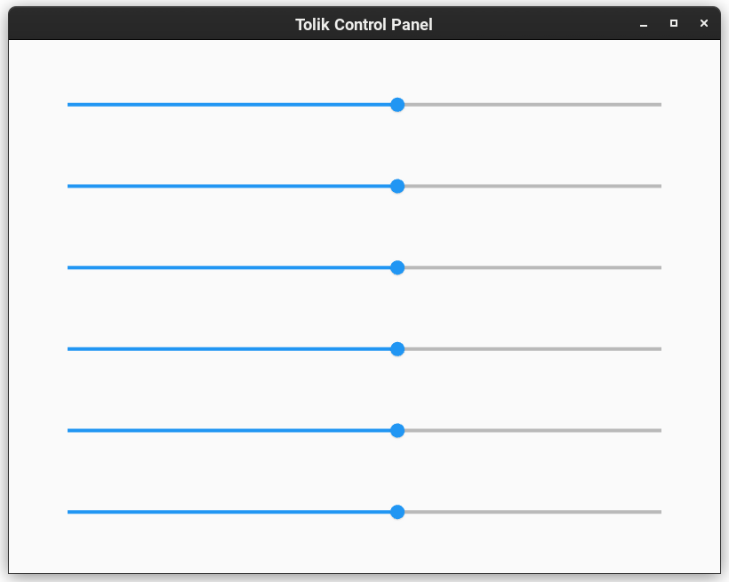

# tolik-control
Программа для управления сервоприводами робо-руки по имени Толик.

    

### Зависимости

Для установки всех необходимых библиотек выполните команду

<code>$ pip3 install -r requirements.txt</code>

### Запуск программы

<code>$ python main.py</code>
 
